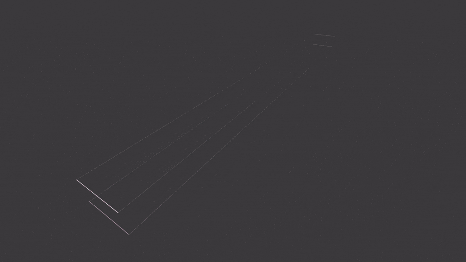

# constrained-innervation-abm
Agent-based model of C. elegans nerve ring assembly. Simulates how transient morphogenetic constraints, pioneer scaffolds, and local axon-axon interactions shape reproducible spatial domains and bimodal connectivity patterns, linking development to population-level wiring statistics.

## Contents
1. [Settup environment](./docs/doc_setup_environment.md)
2. [Generate figure plots](./docs/doc_generate_figure_plots.md)
3. [Testing Models](./docs/doc_testing_models.md)
4. [Precison testing](./docs/doc_precision_testing.md)
5. [Locality testing](./docs/doc_locality_testing.md)
6. [Fixed scaffold testing](./docs/doc_fixed_scaffold_testing.md)

