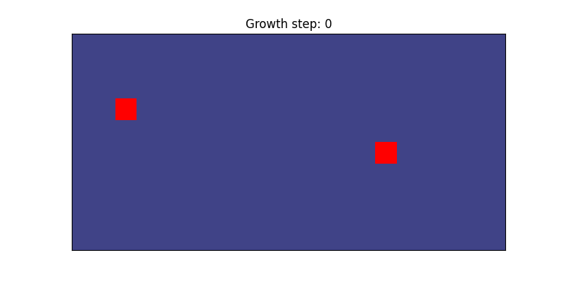
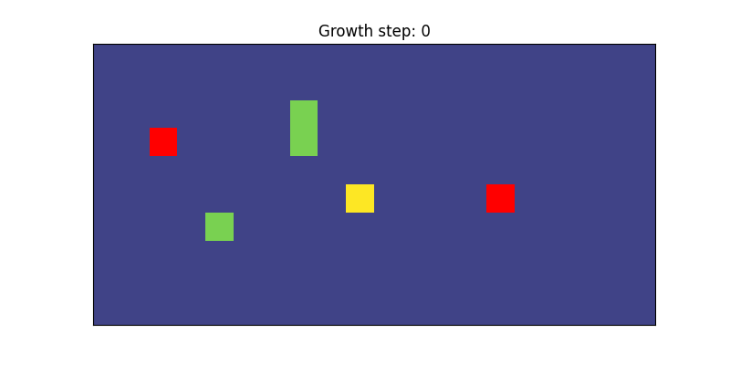
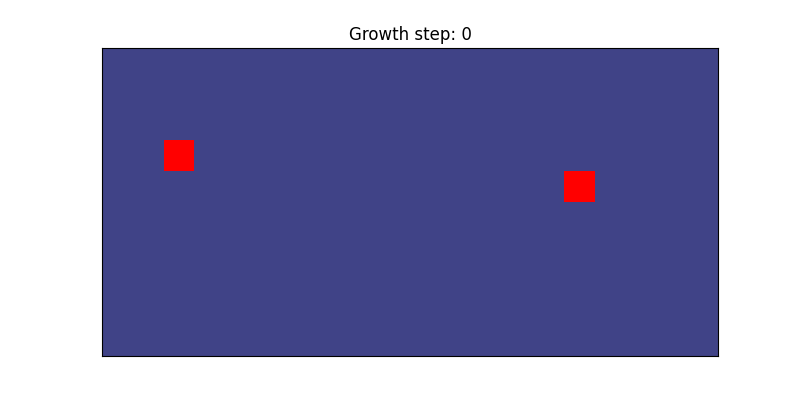
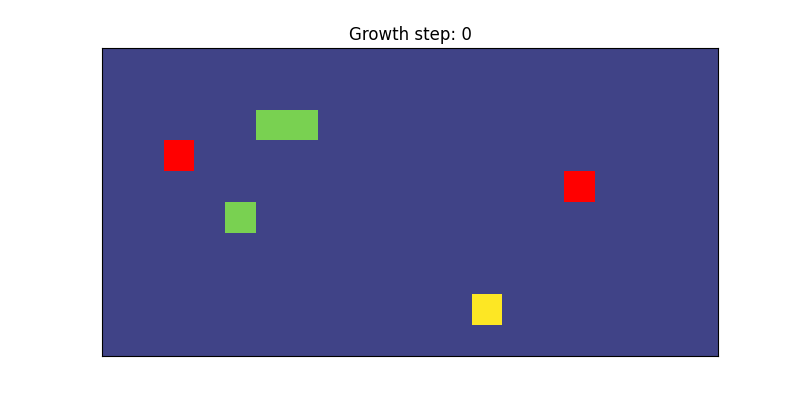

# Fixed pioneer scaffolding testing
This page demonstrates how the pioneer scaffold can be varied by letting a fraction of the pioneers make random trajectories. The fixed pioneer parameter $f$ is adjusted using the "pioneer_fixed" field in the config (.ini) file. The value of the parameter is between 0 and 1, where 1 indicates that all pioneers have fixed trajectory and 0 indicates that all pioneers are allowed to vary their trajectory. Additionally, the "pioneer_fixed_seed" is an integer that ensures that the same pioneers are selected to vary across simulations. 

Below demonstrates the effects of changing precision for a model with 6 agents and 2 pioneers. Pioneer agents are red. Follower agents with the same color are assigned to the same pioneer. 

### Fixed pioneer: 1.0
```
python test/viz_test_model.py viz_simulation configs/model_fixed_scaffold_high.ini
```
  
  


### Fixed pioneer: 0.5
```
python test/viz_test_model.py viz_simulation configs/model_fixed_scaffold_med.ini
```
  
  


