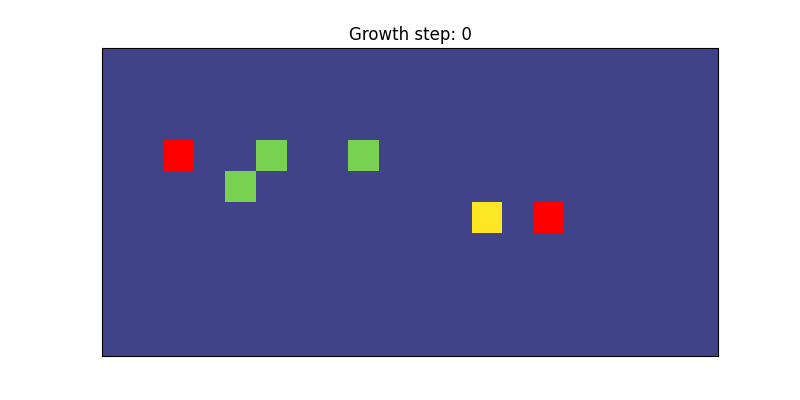
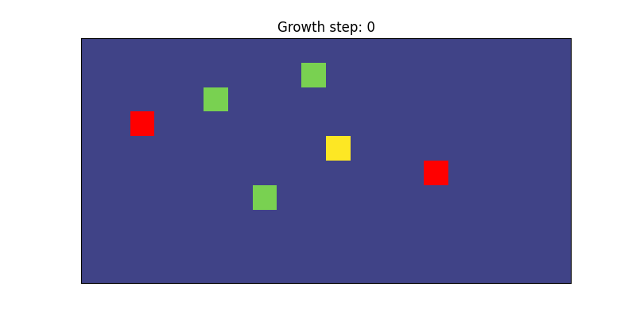

# Follower perturbed testing
This page demonstrates how to perturb a fraction of follower axons. The follower perturbation fraction determines the number of followers that will have their precision set to 0. Follower perturbation is adjusted with the "follower_perturb" and "follower_perturb_seed" in the config (.ini) file. The form is a number between 0 and 1 the latter is an integer seed for random follower selection. Intuitively, 0 means that no followers will be perturbed while 1 means that all followers will be perturbed.

Below demonstrates the effects of changing precision for a model with 6 agents and 2 pioneers. Pioneer agents are red. Follower agents with the same color are assigned to the same pioneer. 

### Follower perturbed: 0
```
python test/viz_test_model.py viz_simulation configs/model_follower_perturb_low.ini 
```
  

### Follower perturbed: 0.5
```
python test/viz_test_model.py viz_simulation configs/model_follower_perturb_med.ini
```
  

