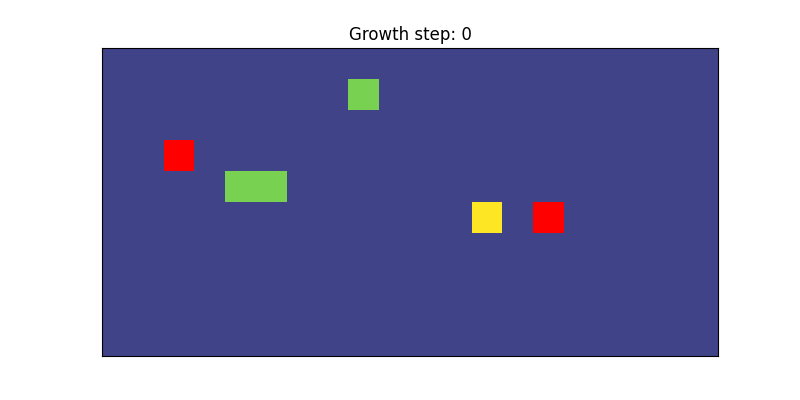
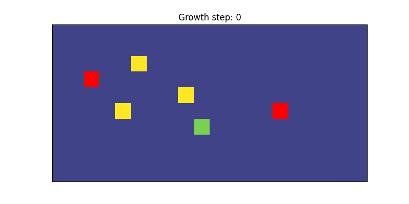

# Locality testing
This page demostrates how locality can be modified in the simulation. Locality determines how close a follower initially placed near its pioneer target. Locality is adjusted using the "agent_locality" field in the config (.ini) file. In the config file, locality is specified as an integer which gives the number of the xth closest pioneer to assign a follower too. For example, locality of 0 assigns followers to the closest pioneer. Locality of 1, assigns followers to the second closest pioneer and so on.

For reporting purposes, we convert locality to a number between 0 and 1. For $p$ pioneers, we covert the above locality integer to a locality score given by $1-locality/(p-1)$. So intuitively, a locality score of 0 means the system is not local and followers are assigned to the furthest pioneer while a locality score of 1 means that the system is local and followers are assigned to nearest pioneer. 

Below demonstrates the effects of changing precision for a model with 6 agents and 2 pioneers. Pioneer agents are red. Follower agents with the same color are assigned to the same pioneer. 

### Locality score: 1
```
python test/viz_test_model.py viz_simulation configs/model_localilty_high.ini
```
  

### Locality score: 0
```
python test/viz_test_model.py viz_simulation configs/model_localilty_low.ini
```
  

