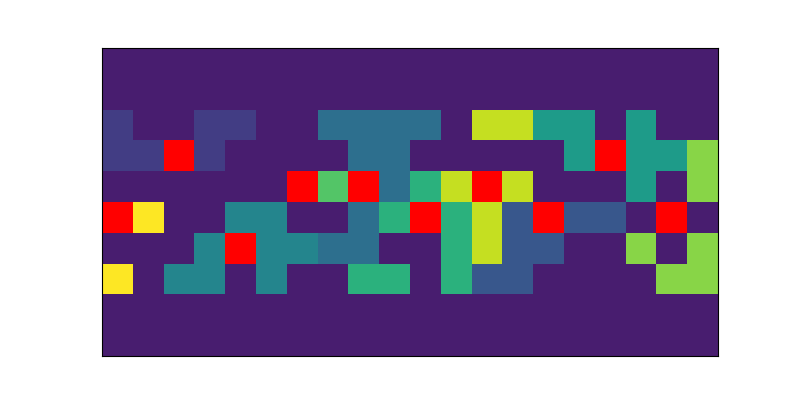
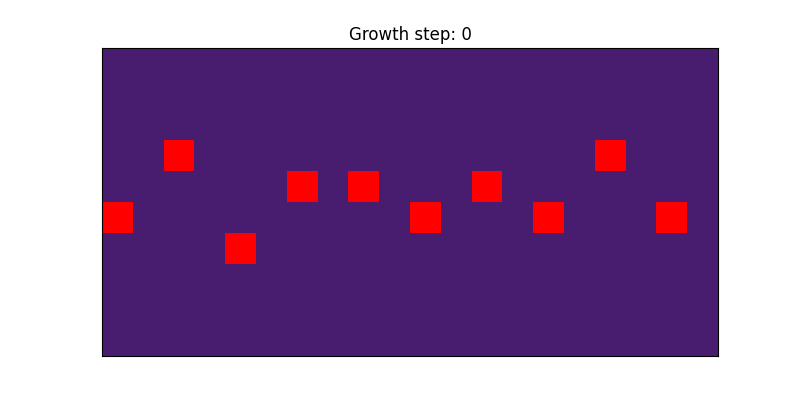
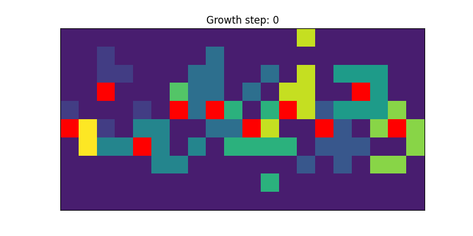

# Testing Models
When developing new simulation models, users may want to test their model debugging purposes. The test/viz_test_model.py script provides some boiler plate code for visuallly testing models. Script functionalities are demonstrated below. To use, make sure to replace with the path to your specific model config file. 

## Visualizing starting grid with pioneers and followers
Plot heatmap of initial positions at first growth slice. Pioneers are red. Emtpy spaces are dark blue. Remaining colors are follower agents.

```
python test/viz_test_model.py viz_grid configs/model.ini 
```



## Visualizing attractor fields 
Plot heatmaps of the pioneer attractor fields for agent targets. Standard usage should display gaussian kernels for centered at each pioneer.

```
python test/viz_test_model.py viz_attractor_fields configs/model.ini
```


## Visualizing simulation
Display animation of simulaiton. Each innervation level (e.g. pioneers and then followers) is displayed separately. At the end of an innervation level push "q" to move to the next innervation level. Note that if saving output as .gif, then the simulation will be written without display. In moview below, top movie shows pioneer innervation, bottom movies shows follower innervation.
```
python test/viz_test_model.py viz_simulation configs/model.ini
```


